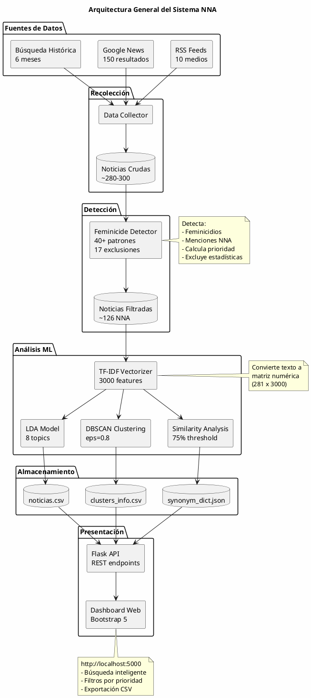
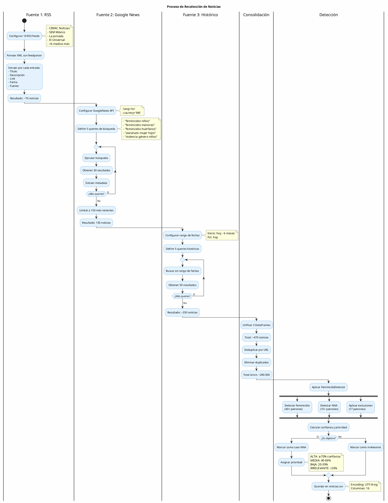
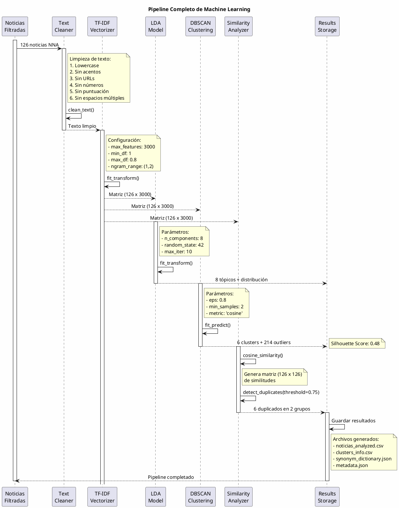
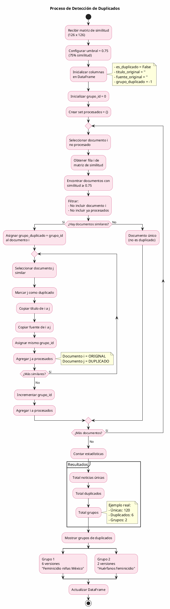
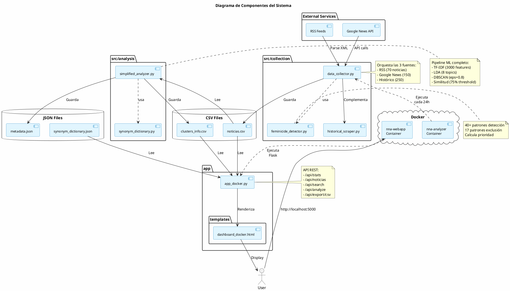
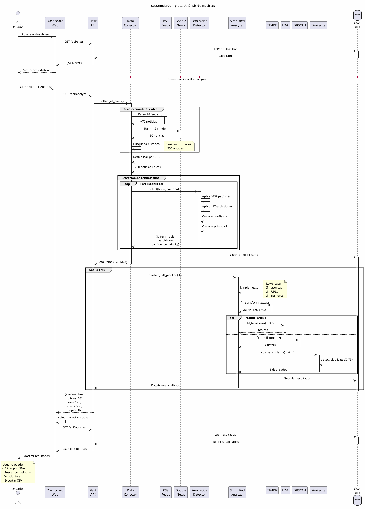

# 📊 Diagramas PlantUML - Sistema de Web Scraping y ML

Este archivo contiene diagramas PlantUML que visualizan todo el proceso del sistema.

---

## 📋 Índice de Diagramas

1. [Arquitectura General del Sistema](#1-arquitectura-general-del-sistema)
2. [Proceso de Recolección (Web Scraping)](#2-proceso-de-recolección-web-scraping)
3. [Pipeline de Machine Learning](#3-pipeline-de-machine-learning)
4. [Flujo de Análisis TF-IDF](#4-flujo-de-análisis-tf-idf)
5. [Proceso de Clustering DBSCAN](#5-proceso-de-clustering-dbscan)
6. [Detección de Duplicados](#6-detección-de-duplicados)
7. [Diagrama de Componentes](#7-diagrama-de-componentes)
8. [Diagrama de Secuencia Completo](#8-diagrama-de-secuencia-completo)

---

## 1. Arquitectura General del Sistema



---

## 2. Proceso de Recolección (Web Scraping)



---

## 3. Pipeline de Machine Learning



---

## 4. Flujo de Análisis TF-IDF

```plantuml
@startuml tfidf_flow
!define RECTANGLE class

skinparam backgroundColor #FEFEFE
skinparam activityBackgroundColor #FFF9C4
skinparam activityBorderColor #F57F17

title Proceso de Vectorización TF-IDF

start

:Recibir textos limpios\n(126 documentos);

:Crear vocabulario;
note right
  Extraer todas las palabras únicas
  y bigramas del corpus
end note

:Aplicar filtros;
partition "Filtrado" {
  :Eliminar palabras en >80% docs\n(max_df=0.8);
  :Mantener palabras en ≥1 doc\n(min_df=1);
  :Seleccionar top 3000 features;
}

:Calcular Term Frequency (TF);
note right
  TF = (veces que aparece palabra) / 
       (total palabras del documento)
end note

:Calcular Inverse Document Frequency (IDF);
note right
  IDF = log(total docs / 
            docs con la palabra)
end note

:Multiplicar TF × IDF;

:Generar matriz dispersa;
note right
  Shape: (126 noticias, 3000 features)
  Formato: scipy.sparse.csr_matrix
  Valores: pesos TF-IDF (0.0 a 1.0)
end note

split
  :Enviar a LDA;
split again
  :Enviar a DBSCAN;
split again
  :Enviar a Similarity Analyzer;
end split

:Matriz TF-IDF lista;

stop

note bottom
  Ejemplo de valores:
  Doc_0: [0.42, 0.0, 0.31, 0.50, ...]
  - "feminicidio": 0.42
  - "oaxaca": 0.0 (no aparece)
  - "mujer": 0.31
  - "niños": 0.50
end note

@enduml
```

---

## 5. Proceso de Clustering DBSCAN

```plantuml
@startuml dbscan_clustering
!define RECTANGLE class

skinparam backgroundColor #FEFEFE
skinparam activityBackgroundColor #E8F5E9
skinparam activityBorderColor #388E3C

title Proceso de Clustering DBSCAN

start

:Recibir matriz TF-IDF\n(126 x 3000);

:Configurar DBSCAN;
note right
  eps = 0.8
  min_samples = 2
  metric = 'cosine'
end note

:Inicializar etiquetas\ntodos = -1 (sin cluster);

partition "Algoritmo DBSCAN" {
  repeat
    :Seleccionar documento i\nno procesado;
    
    :Calcular distancias coseno\ncon todos los documentos;
    
    :Encontrar vecinos\n(distancia ≤ eps);
    
    if (¿Tiene ≥ min_samples vecinos?) then (Sí)
      :Crear nuevo cluster\nID = n;
      :Asignar documento i\nal cluster n;
      
      repeat
        :Seleccionar vecino j\ndel cluster;
        :Encontrar vecinos de j;
        
        if (¿Tiene ≥ min_samples?) then (Sí)
          :Agregar vecinos\nal cluster;
          :Procesar vecinos\nrecursivamente;
        else (No)
          :Marcar como borde\ndel cluster;
        endif
        
      repeat while (¿Más vecinos?) is (Sí)
      ->No;
      
    else (No)
      :Marcar como outlier\n(cluster = -1);
    endif
    
  repeat while (¿Documentos sin procesar?) is (Sí)
  ->No;
}

:Contar clusters formados;
:Contar outliers;

:Calcular Silhouette Score;
note right
  Mide calidad del clustering
  Rango: -1 (malo) a 1 (excelente)
end note

:Generar resumen de clusters;

fork
  :Cluster 0: 6 docs\n(datos, estadísticas);
fork again
  :Cluster 1: 5 docs\n(cimac, sem);
fork again
  :Cluster 2: 3 docs\n(oaxaca, casos);
fork again
  :Cluster 3: 3 docs\n(huérfanos, político);
fork again
  :Cluster 4: 3 docs\n(madres, víctimas);
fork again
  :Cluster 5: 4 docs\n(edomex, sol);
fork again
  :Outliers: 102 docs\n(casos únicos);
end fork

:Guardar resultados;

stop

note bottom
  Resultado:
  - 6 clusters pequeños
  - 102 outliers (81%)
  - Silhouette: 0.48 (bueno)
end note

@enduml
```

---

## 6. Detección de Duplicados



---

## 7. Diagrama de Componentes



---

## 8. Diagrama de Secuencia Completo



---

## 📝 Cómo Usar estos Diagramas

### Opción 1: PlantUML Online
1. Visita: http://www.plantuml.com/plantuml/uml/
2. Copia el código de cualquier diagrama
3. Pega en el editor
4. Visualiza el diagrama generado

### Opción 2: VS Code Extension
1. Instala la extensión "PlantUML" en VS Code
2. Abre este archivo .md
3. Presiona `Alt+D` para previsualizar diagramas

### Opción 3: Generar Imágenes
```bash
# Instalar PlantUML
npm install -g node-plantuml

# Generar PNG
plantuml diagrama.puml -tpng

# Generar SVG
plantuml diagrama.puml -tsvg
```

---

## 🎨 Leyenda de Colores

- **Azul** (#E3F2FD): Procesos de recolección
- **Amarillo** (#FFF9C4): Procesos de transformación (TF-IDF)
- **Verde** (#E8F5E9): Procesos de clustering
- **Rosa** (#FCE4EC): Procesos de detección de duplicados
- **Cyan** (#E1F5FE): Componentes del sistema

---

**Creado:** 19 de noviembre de 2025  
**Sistema:** TT-1 NNA v3.0.0  
**Formato:** PlantUML
