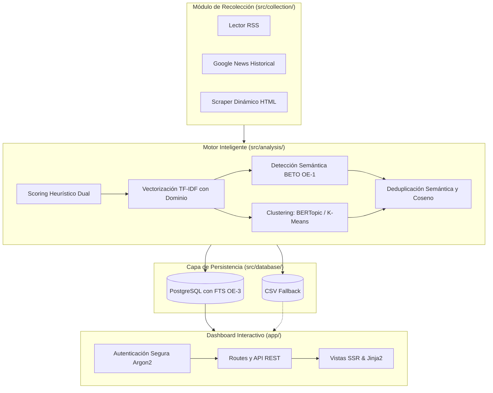

# Sistema Inteligente para la Identificación y Seguimiento de NNA — Manifiesto Técnico v5.0

Este documento constituye la **única referencia técnica estandarizada** del proyecto. La documentación teórica, contextual y metodológica, así como los manuales completos, residen en el repositorio secundario LaTeX enfocado a la titulación universitaria.

---

## 1. Arquitectura del Sistema

El proyecto sigue un diseño de **Monolito Modular** construido paralelamente en un entorno dockerizado para integrar fácilmente el módulo de machine learning junto a un dashboard web reactivo provisto por Flask.

### Componentes Clave:
*   **Recolección Flexible:** Uso inteligente de trafilatura y lxml garantizando lecturas con control en `robots.txt` a medios nacionales (estado o regionales).
*   **Combinación y Ensamblaje NLP:** Fusión entre lógica manual estricta por `TF-IDF` y análisis zero-shot contextual con redes transformacionales preentrenadas (*BETO*).
*   **Dual-Storage:** Empleo primario de **PostgreSQL GIN / tsvector** y como sistema heredable continuo una fuente de lectura *CSV.* 

---

## 2. Diccionario de Módulos (Repository Structure)

A continuación, se describen los bloques troncales en el código y sus roles inmutables. 

### a) `app/` (Capa de Presentación y Ruteo)
*   **`models.py`**: Modelos de capa aplicación para `User` (credenciales e inicio seguro manejado por Argon2) y perfiles `NewsSource` controlables por administradores.
*   **`main/routes.py`**: Intercomunicador API REST (proveyendo `/api/stats`, `/api/noticias`, `/api/search`) y vistas del dashboard principal para control gerencial.

### b) `src/collection/` (Extracción de Datos)
*   **`collector.py`**: Orquestador principal que ejecuta extraclases para descargar de URLs en RSS (`config.py`).
*   **`scraper.py` y `historical_scraper.py`**: Componentes purísimos para realizar parseos a través de utilidades como `trafilatura` y `BeautifulSoup`, resolviendo consultas complejas para el pasado. 

### c) `src/analysis/` (Cerebro Analítico - Core)
*   **`analyzer.py`**: Ejecuta la matriz de pipeline 11 pasos; controla la inserción heurística y redirige datos hacia clustering y bases FTS.
*   **`bertopic_clustering.py`**: Proceso OE-4 para hallar sub-tópicos mediante **BETO**, reducción bidimensional vía **UMAP**, clústerización vía **HDBSCAN**.
*   **`semantic_detector.py`**: Evaluación semántica híbrida que revisa "víctimas indirectas" o "feminicidios".
*   **`dedup.py`**: Algorítmica especializada para eliminar repeticiones idénticas (SimHash y factor Jaccard inter-site).
*   **`synonyms.py`**: Diccionario inteligente que autoasiste búsquedas como *menores -> infantil -> niñez -> huérfano*.

### d) `src/database/` (Orquestación de Persistencia - OE-3)
*   **`models_noticias.py`**: Esquemas estructurados (`Noticia`, `Deteccion`, `ClusterSemantico`, `Entidad`) aprovechando índices TSVECTOR nativos postgres para Full Text Search (FTS).
*   **`repository.py`**: Funciones crudas que gestionan CRUD seguro contra variables `app.models.db`.

### e) Configuración Centralizada
*   **`config.py`**: Repositorio de pesajes absolutos (`RELEVANCE_WEIGHT_FEMINICIDIO = 0.55`, `NNA = 0.45`), query strings de noticias de Google preprogramadas y credenciales inyectables.
*   **`Dockerfile` / `docker-compose.yml`**: Define contenedores Alpine/Slim manejados de manera desvinculada para aplicación (incluye model caching local de huggingface) y su persistencia base-datos.

---

## 3. Guía de Funcionamiento: Flujo de una Noticia

Desde la aparición del evento público a la métrica en la interfaz de usuario:

1.  **Activación de Extracción**: Ejecución calendarizada del orquestador o disparo manual. Genera la ingesta de noticias a través de RSS limitando dominios en México.
2.  **Filtrado Heurístico L1**: Validación inicial del string para la detección estricta de nombres (`femicidio`, etc).
3.  **Matemática Dimensional NLP L2**: `TF-IDF` y penalización sublineal para destacar keywords específicas. La noticia se vectoriza.
4.  **Deduplicación e Inyección BETO**: En base a *BETO* (`SemanticDetector`), se halla similitud al modelo base. Se desechan duplicados de agencias internacionales si la noticia trata de un mismo suceso en distinto tiempo.
5.  **Clustering OE-4**: Clasificación no supervisada; se une a una etiqueta general con noticias similares.
6.  **Persistencia (PostgreSQL / FTS)**: Guardado y normalización al modelo lógico.
7.  **Despliegue UI**: Un usuario consulta la aplicación, e invocando `/api/noticias` ordena sus filtros y puede realizar búsquedas Full Text Search que buscan internamente en la DB en tiempo O(log N).

---

## 4. Roadmap de Mejoras Pendientes

### Estructura y Código
- [ ] **Manejo Total hacia Asíncrono:** Evolución de requests sincrónicas para descarga `HTML/RSS` con bibliotecas como `aiohttp` y `BeautifulSoup`, optimizando CPU bloqueada.
- [ ] **Refinamiento a Arquitectura de Hexágono (Ports/Adapters):** Desacoplar por completo los endpoints dependientes de vistas de datos.
- [ ] **Redis para Caching:** Aprovechar la capa REST agregando in-memory cache para re-cálculos de estadística que duran > 50ms hoy. 

### Modelado
- [ ] **Ajuste Fino de BETO:** Moverse gradualmente de "Zero-Shot" a "Fine-Tuned" en el scoring semántico recolectando las etiquetas humanas proveídas desde el dashboard para entrenarlo.
- [ ] **Ejes Ponderales C-TF-IDF (Dinamismo):** Modificación del 55/45 en `config.py` haciéndolo dependiente de distribución empírica de entrenamiento.
