# Códigos de Diagramas — Sistema Inteligente NNA

> Cada sección contiene código listo para copiar y pegar en la plataforma indicada.
> Solo copia, pega y exporta como PNG/SVG/PDF.

---

## Índice

1. [Diagrama Entidad-Relación (dbdiagram.io)](#1-diagrama-entidad-relación)
2. [Diagrama de Casos de Uso General (PlantUML)](#2-diagrama-de-casos-de-uso-general)
3. [Diagrama de Casos de Uso Detallado (PlantUML)](#3-diagrama-de-casos-de-uso-detallado)
4. [Diagrama de Arquitectura General (Mermaid)](#4-diagrama-de-arquitectura-general)
5. [Diagrama de Despliegue Docker (Mermaid)](#5-diagrama-de-despliegue-docker)
6. [Diagrama de Componentes (PlantUML)](#6-diagrama-de-componentes)
7. [Diagrama de Flujo — Recolección (Mermaid)](#7-diagrama-de-flujo--recolección)
8. [Diagrama de Flujo — Análisis 11 pasos (Mermaid)](#8-diagrama-de-flujo--análisis-11-pasos)
9. [Diagrama de Flujo — Clasificación Dual (Mermaid)](#9-diagrama-de-flujo--clasificación-dual)
10. [Diagrama de Flujo — Deduplicación en Cascada (Mermaid)](#10-diagrama-de-flujo--deduplicación-en-cascada)
11. [Diagrama de Secuencia — Iniciar Sesión CU-01 (PlantUML)](#11-diagrama-de-secuencia--iniciar-sesión-cu-01)
12. [Diagrama de Secuencia — Consultar Tablero CU-03 (PlantUML)](#12-diagrama-de-secuencia--consultar-tablero-cu-03)
13. [Diagrama de Secuencia — Buscar Noticias CU-04 (PlantUML)](#13-diagrama-de-secuencia--buscar-noticias-cu-04)
14. [Diagrama de Secuencia — Gestionar Fuentes CU-05 (PlantUML)](#14-diagrama-de-secuencia--gestionar-fuentes-cu-05)
15. [Diagrama de Secuencia — Análisis Automático (PlantUML)](#15-diagrama-de-secuencia--análisis-automático)
16. [Diagrama de Estados — Noticia (PlantUML)](#16-diagrama-de-estados--ciclo-de-vida-de-una-noticia)
17. [Diagrama de Estados — Sesión de Usuario (PlantUML)](#17-diagrama-de-estados--sesión-de-usuario)
18. [Diagrama de Navegación (Mermaid)](#18-diagrama-de-navegación)
19. [Diagrama de Clases (PlantUML)](#19-diagrama-de-clases)
20. [Diagrama de Paquetes (PlantUML)](#20-diagrama-de-paquetes)
21. [Diagrama de Flujo — Detección Semántica BETO (Mermaid)](#21-diagrama-de-flujo--detección-semántica-beto-oe-1)
22. [Diagrama de Flujo — BERTopic (Mermaid)](#22-diagrama-de-flujo--agrupamiento-bertopic-oe-4)
23. [Diagrama de Flujo — Búsqueda FTS (Mermaid)](#23-diagrama-de-flujo--búsqueda-fts-oe-3)
24. [Diagrama de Actividades — Ciclo Completo (PlantUML)](#24-diagrama-de-actividades--ciclo-completo)

---

## Plataformas donde pegar cada código

| Plataforma | Diagramas | Enlace |
|---|---|---|
| **dbdiagram.io** | Solo el #1 (ER) | https://dbdiagram.io |
| **PlantUML** | #2, #3, #6, #11–#17, #19, #20, #24 | https://www.plantuml.com/plantuml/uml |
| **Mermaid Live** | #4, #5, #7–#10, #18, #21–#23 | https://mermaid.live |

---

## 1. Diagrama Entidad-Relación

**Plataforma:** https://dbdiagram.io — pegar en el editor de la izquierda.

```dbml
// ============================================
// DIAGRAMA ER — Sistema Inteligente NNA
// Plataforma: dbdiagram.io
// ============================================

Table users {
  id integer [pk, increment]
  username varchar(80) [unique, not null]
  email varchar(120) [unique, not null]
  password_hash varchar(256) [note: 'Argon2id']
  is_active boolean [default: true]
  is_admin boolean [default: false]
  created_at timestamptz [default: `now()`]
  last_login timestamptz
}

Table news_sources {
  id integer [pk, increment]
  name varchar(200) [not null]
  url varchar(2000) [unique, not null]
  source_type varchar(20) [note: 'auto | rss | sitemap | html']
  is_active boolean [default: true]
  is_predefined boolean [default: false]
  added_by integer [ref: > users.id]
  created_at timestamptz [default: `now()`]
  last_scraped timestamptz
  last_status varchar(50)
  last_error text
  articles_found integer [default: 0]
  crawl_delay integer
  notes text
}

Table noticias {
  id integer [pk, increment]
  titulo varchar(500) [not null]
  contenido text
  enlace varchar(2000) [unique]
  fuente varchar(300)
  fecha timestamptz

  // --- Puntuación de relevancia (eje dual) ---
  score_feminicidio float
  score_nna float
  score_compuesto float [note: '0.55×fem + 0.45×nna']
  relevancia_final float
  clasificacion varchar(20) [note: 'Alta | Media | Baja | No relevante']
  clasificacion_final varchar(20)

  // --- Detección semántica (OE-1) ---
  score_semantico float
  modo_deteccion varchar(30) [note: 'zero_shot | finetuned | hybrid']

  // --- Agrupamiento (OE-4) ---
  cluster_id integer [ref: > clusters_semanticos.id]
  topic_id integer
  topic_description varchar(200)

  // --- Metadatos ---
  max_similarity float
  content_hash varchar(64) [note: 'MD5 para deduplicación']
  scrape_method varchar(30) [note: 'rss | html | sitemap | google_news']
  menores_identificados varchar(5)

  // --- Búsqueda de texto completo (OE-3) ---
  busqueda_fts tsvector [note: 'Generado por trigger automático']

  // --- Timestamps ---
  created_at timestamptz [default: `now()`]
  updated_at timestamptz [default: `now()`]

  indexes {
    busqueda_fts [type: gin, note: 'Búsqueda texto completo < 10ms']
    fecha [note: 'B-tree DESC']
    score_compuesto [note: 'B-tree DESC']
    cluster_id [note: 'B-tree']
    content_hash [type: hash]
  }
}

Table detecciones {
  id integer [pk, increment]
  noticia_id integer [unique, ref: - noticias.id, note: 'Relación 1:1']

  // --- Auditoría de clasificación ---
  score_heuristico float
  score_semantico float
  score_hibrido float
  clasificacion_heuristica varchar(20)
  clasificacion_hibrida varchar(20)

  keywords_feminicidio json
  keywords_nna json

  confianza_semantica float
  modo_semantico varchar(30)
  alpha_usado float

  menores_identificados boolean
  num_menores_mencionados integer
  edades_mencionadas json

  created_at timestamptz [default: `now()`]
}

Table clusters_semanticos {
  id integer [pk, note: 'Topic ID de BERTopic']
  etiqueta varchar(200) [note: 'Ej: Feminicidio · Menor · Huérfano']
  descripcion text
  terminos_principales json [note: 'Top términos con pesos c-TF-IDF']
  num_documentos integer
  cohesion float [note: 'Score de cohesión interna (0-1)']
  es_outlier boolean [note: 'True si topic_id = -1']
  modelo_version varchar(50)
  created_at timestamptz [default: `now()`]
}

Table entidades {
  id integer [pk, increment]
  noticia_id integer [ref: > noticias.id]
  texto varchar(200)
  tipo varchar(10) [note: 'PER | LOC | ORG | MISC']
  posicion_inicio integer
  posicion_fin integer
  confianza float

  indexes {
    tipo [note: 'B-tree para filtrar por tipo']
  }
}
```

---

## 2. Diagrama de Casos de Uso General

**Plataforma:** https://www.plantuml.com/plantuml/uml

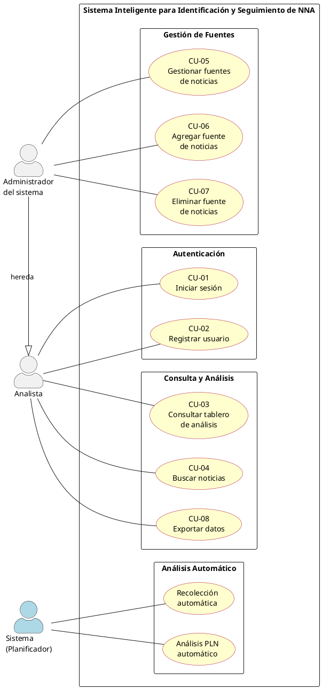
```plantuml
@startuml CasosDeUsoGeneral
left to right direction
skinparam packageStyle rectangle
skinparam actorStyle awesome
skinparam usecase {
  BackgroundColor #FEFECE
  BorderColor #A80036
}

actor "Analista" as analista
actor "Administrador\ndel sistema" as admin
actor "Sistema\n(Planificador)" as sistema #LightBlue

admin -|> analista : «hereda»

rectangle "Sistema Inteligente para Identificación y Seguimiento de NNA" {

  package "Autenticación" {
    usecase "CU-01\nIniciar sesión" as CU01
    usecase "CU-02\nRegistrar usuario" as CU02
  }

  package "Consulta y Análisis" {
    usecase "CU-03\nConsultar tablero\nde análisis" as CU03
    usecase "CU-04\nBuscar noticias" as CU04
    usecase "CU-08\nExportar datos" as CU08
  }

  package "Gestión de Fuentes" {
    usecase "CU-05\nGestionar fuentes\nde noticias" as CU05
    usecase "CU-06\nAgregar fuente\nde noticias" as CU06
    usecase "CU-07\nEliminar fuente\nde noticias" as CU07
  }

  package "Análisis Automático" {
    usecase "Recolección\nautomática" as RECOLECCION
    usecase "Análisis PLN\nautomático" as ANALISIS_PLN
  }
}

analista -- CU01
analista -- CU02
analista -- CU03
analista -- CU04
analista -- CU08

admin -- CU05
admin -- CU06
admin -- CU07

sistema -- RECOLECCION
sistema -- ANALISIS_PLN

@enduml
```

---

## 3. Diagrama de Casos de Uso Detallado

**Plataforma:** https://www.plantuml.com/plantuml/uml

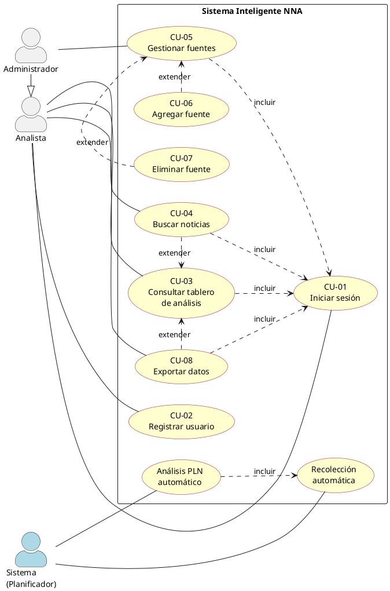
```plantuml
@startuml CasosDeUsoDetallado
left to right direction
skinparam actorStyle awesome
skinparam usecase {
  BackgroundColor #FEFECE
  BorderColor #A80036
}

actor "Analista" as analista
actor "Administrador" as admin
actor "Sistema\n(Planificador)" as sistema #LightBlue

admin -|> analista

rectangle "Sistema Inteligente NNA" {
  usecase "CU-01\nIniciar sesión" as CU01
  usecase "CU-02\nRegistrar usuario" as CU02
  usecase "CU-03\nConsultar tablero\nde análisis" as CU03
  usecase "CU-04\nBuscar noticias" as CU04
  usecase "CU-05\nGestionar fuentes" as CU05
  usecase "CU-06\nAgregar fuente" as CU06
  usecase "CU-07\nEliminar fuente" as CU07
  usecase "CU-08\nExportar datos" as CU08
  usecase "Recolección\nautomática" as REC
  usecase "Análisis PLN\nautomático" as ANA
}

analista -- CU01
analista -- CU02
analista -- CU03
analista -- CU04
analista -- CU08

admin -- CU05

sistema -- REC
sistema -- ANA

CU03 ..> CU01 : «incluir»
CU04 ..> CU01 : «incluir»
CU05 ..> CU01 : «incluir»
CU08 ..> CU01 : «incluir»

CU04 .> CU03 : «extender»
CU08 .> CU03 : «extender»
CU06 .> CU05 : «extender»
CU07 .> CU05 : «extender»

ANA ..> REC : «incluir»

@enduml
```

---

## 4. Diagrama de Arquitectura General

**Plataforma:** https://mermaid.live

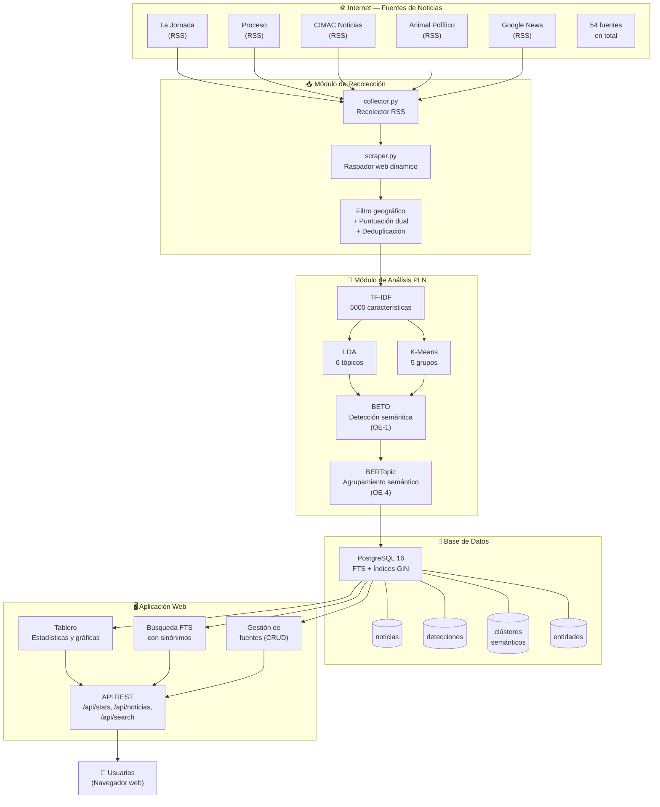
```mermaid
graph TB
    subgraph Internet["🌐 Internet — Fuentes de Noticias"]
        F1["La Jornada<br/>(RSS)"]
        F2["Proceso<br/>(RSS)"]
        F3["CIMAC Noticias<br/>(RSS)"]
        F4["Animal Político<br/>(RSS)"]
        F5["Google News<br/>(RSS)"]
        F6["54 fuentes<br/>en total"]
    end

    subgraph Recoleccion["📥 Módulo de Recolección"]
        COL["collector.py<br/>Recolector RSS"]
        SCR["scraper.py<br/>Raspador web dinámico"]
        FILT["Filtro geográfico<br/>+ Puntuación dual<br/>+ Deduplicación"]
    end

    subgraph Analisis["🧠 Módulo de Análisis PLN"]
        TFIDF["TF-IDF<br/>5000 características"]
        LDA["LDA<br/>6 tópicos"]
        KMEANS["K-Means<br/>5 grupos"]
        BETO["BETO<br/>Detección semántica<br/>(OE-1)"]
        BERT["BERTopic<br/>Agrupamiento semántico<br/>(OE-4)"]
    end

    subgraph BD["🗄️ Base de Datos"]
        PG["PostgreSQL 16<br/>FTS + Índices GIN"]
        T1[("noticias")]
        T2[("detecciones")]
        T3[("clústeres<br/>semánticos")]
        T4[("entidades")]
    end

    subgraph Web["🖥️ Aplicación Web"]
        DASH["Tablero<br/>Estadísticas y gráficas"]
        BUSQ["Búsqueda FTS<br/>con sinónimos"]
        FUEN["Gestión de<br/>fuentes (CRUD)"]
        API["API REST<br/>/api/stats, /api/noticias,<br/>/api/search"]
    end

    USR["👤 Usuarios<br/>(Navegador web)"]

    F1 & F2 & F3 & F4 & F5 --> COL
    COL --> SCR
    SCR --> FILT
    FILT --> TFIDF
    TFIDF --> LDA & KMEANS
    LDA --> BETO
    KMEANS --> BETO
    BETO --> BERT
    BERT --> PG
    PG --- T1 & T2 & T3 & T4
    PG --> DASH & BUSQ & FUEN
    DASH & BUSQ & FUEN --> API
    API --> USR
```

---

## 5. Diagrama de Despliegue Docker

**Plataforma:** https://mermaid.live

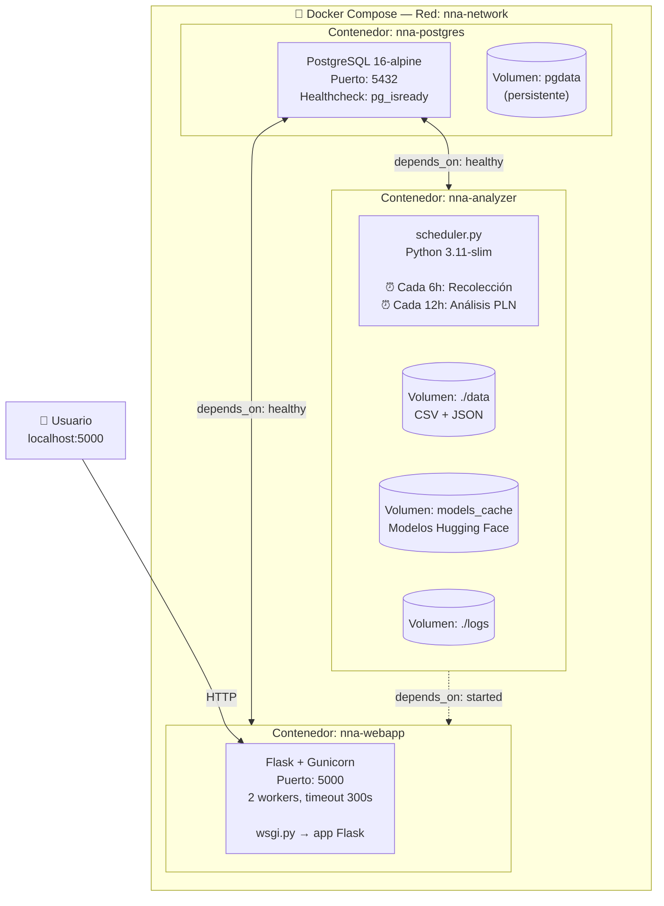
```mermaid
graph TB
    subgraph DockerCompose["🐳 Docker Compose — Red: nna-network"]

        subgraph C1["Contenedor: nna-postgres"]
            PG["PostgreSQL 16-alpine<br/>Puerto: 5432<br/>Healthcheck: pg_isready"]
            VOL1[("Volumen: pgdata<br/>(persistente)")]
        end

        subgraph C2["Contenedor: nna-analyzer"]
            SCH["scheduler.py<br/>Python 3.11-slim<br/><br/>⏰ Cada 6h: Recolección<br/>⏰ Cada 12h: Análisis PLN"]
            VOL2[("Volumen: ./data<br/>CSV + JSON")]
            VOL3[("Volumen: models_cache<br/>Modelos Hugging Face")]
            VOL4[("Volumen: ./logs")]
        end

        subgraph C3["Contenedor: nna-webapp"]
            FLASK["Flask + Gunicorn<br/>Puerto: 5000<br/>2 workers, timeout 300s<br/><br/>wsgi.py → app Flask"]
        end
    end

    PG <-->|depends_on: healthy| C2
    PG <-->|depends_on: healthy| C3
    C2 -.->|depends_on: started| C3

    USUARIO["👤 Usuario<br/>localhost:5000"] -->|HTTP| FLASK
```

---

## 6. Diagrama de Componentes

**Plataforma:** https://www.plantuml.com/plantuml/uml

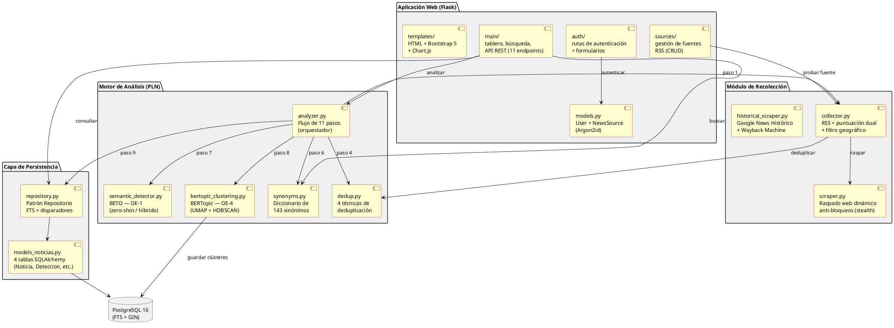
```plantuml
@startuml Componentes
skinparam component {
  BackgroundColor #FEFECE
  BorderColor #A80036
}
skinparam package {
  BackgroundColor #F0F0F0
}

package "Aplicación Web (Flask)" as webapp {
  [auth/\nrutas de autenticación\n+ formularios] as AUTH
  [main/\ntablero, búsqueda,\nAPI REST (11 endpoints)] as MAIN
  [sources/\ngestión de fuentes\nRSS (CRUD)] as SRC
  [models.py\nUser + NewsSource\n(Argon2id)] as MODELS
  [templates/\nHTML + Bootstrap 5\n+ Chart.js] as TMPL
}

package "Motor de Análisis (PLN)" as motor {
  [analyzer.py\nFlujo de 11 pasos\n(orquestador)] as ANALYZER
  [semantic_detector.py\nBETO — OE-1\n(zero-shot / híbrido)] as BETO
  [bertopic_clustering.py\nBERTopic — OE-4\n(UMAP + HDBSCAN)] as BTOPIC
  [dedup.py\n4 técnicas de\ndeduplicación] as DEDUP
  [synonyms.py\nDiccionario de\n143 sinónimos] as SYN
}

package "Módulo de Recolección" as recolec {
  [collector.py\nRSS + puntuación dual\n+ filtro geográfico] as COL
  [scraper.py\nRaspado web dinámico\nanti-bloqueos (stealth)] as SCR
  [historical_scraper.py\nGoogle News Histórico\n+ Wayback Machine] as HIST
}

package "Capa de Persistencia" as persist {
  [models_noticias.py\n4 tablas SQLAlchemy\n(Noticia, Deteccion, etc.)] as DBMOD
  [repository.py\nPatrón Repositorio\nFTS + disparadores] as REPO
}

database "PostgreSQL 16\n(FTS + GIN)" as PG

MAIN --> ANALYZER : analizar
MAIN --> REPO : consultar
MAIN --> SYN : buscar
AUTH --> MODELS : autenticar
SRC --> COL : probar fuente

ANALYZER --> BETO : paso 7
ANALYZER --> BTOPIC : paso 8
ANALYZER --> DEDUP : paso 4
ANALYZER --> SYN : paso 6
ANALYZER --> COL : paso 1
ANALYZER --> REPO : paso 9

COL --> SCR : raspar
COL --> DEDUP : deduplicar

REPO --> DBMOD
DBMOD --> PG
BTOPIC --> PG : guardar clústeres

@enduml
```

---

## 7. Diagrama de Flujo — Recolección

**Plataforma:** https://mermaid.live

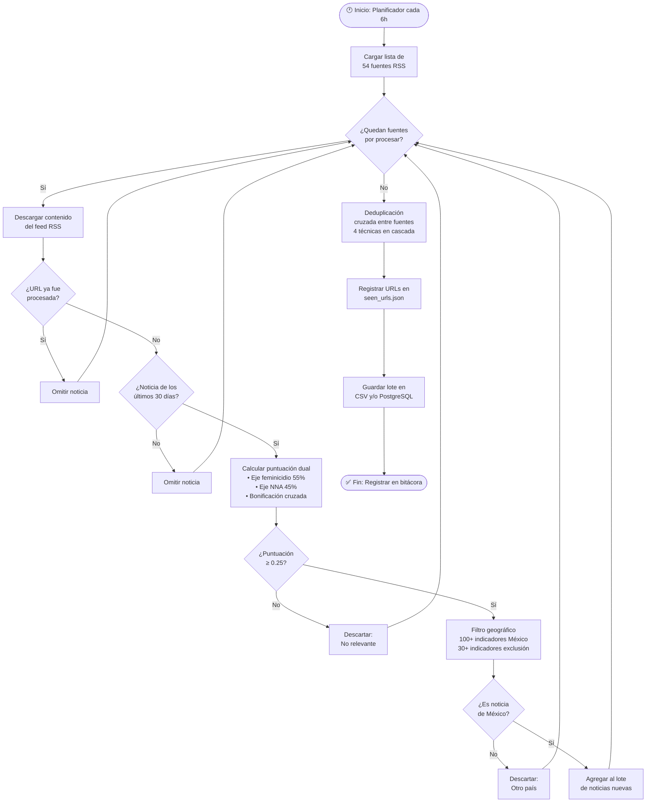
```mermaid
flowchart TD
    INICIO([🕐 Inicio: Planificador cada 6h]) --> CARGAR[Cargar lista de<br/>54 fuentes RSS]
    CARGAR --> LOOP{¿Quedan fuentes<br/>por procesar?}
    LOOP -- No --> DEDUP_GLOBAL[Deduplicación<br/>cruzada entre fuentes<br/>4 técnicas en cascada]
    LOOP -- Sí --> DESCARGAR[Descargar contenido<br/>del feed RSS]

    DESCARGAR --> URL_CHECK{¿URL ya fue<br/>procesada?}
    URL_CHECK -- Sí --> OMITIR1[Omitir noticia]
    URL_CHECK -- No --> EDAD_CHECK{¿Noticia de los<br/>últimos 30 días?}

    EDAD_CHECK -- No --> OMITIR2[Omitir noticia]
    EDAD_CHECK -- Sí --> SCORE[Calcular puntuación dual<br/>• Eje feminicidio 55%<br/>• Eje NNA 45%<br/>• Bonificación cruzada]

    SCORE --> REL_CHECK{¿Puntuación<br/>≥ 0.25?}
    REL_CHECK -- No --> DESCARTAR1[Descartar:<br/>No relevante]
    REL_CHECK -- Sí --> GEO[Filtro geográfico<br/>100+ indicadores México<br/>30+ indicadores exclusión]

    GEO --> MEX_CHECK{¿Es noticia<br/>de México?}
    MEX_CHECK -- No --> DESCARTAR2[Descartar:<br/>Otro país]
    MEX_CHECK -- Sí --> AGREGAR[Agregar al lote<br/>de noticias nuevas]

    OMITIR1 --> LOOP
    OMITIR2 --> LOOP
    DESCARTAR1 --> LOOP
    DESCARTAR2 --> LOOP
    AGREGAR --> LOOP

    DEDUP_GLOBAL --> REGISTRAR[Registrar URLs en<br/>seen_urls.json]
    REGISTRAR --> GUARDAR[Guardar lote en<br/>CSV y/o PostgreSQL]
    GUARDAR --> FIN([✅ Fin: Registrar en bitácora])
```

---

## 8. Diagrama de Flujo — Análisis 11 pasos

**Plataforma:** https://mermaid.live


```mermaid
flowchart TD
    INICIO([🕐 Inicio: Planificador cada 12h]) --> P1

    P1["<b>Paso 1:</b> Vectorización TF-IDF<br/>5000 características, n-gramas (1,3)<br/>Aumento de dominio"] --> P2

    P2["<b>Paso 2:</b> Modelado de tópicos LDA<br/>6 tópicos, 30 iteraciones"] --> P3

    P3["<b>Paso 3:</b> Agrupamiento K-Means<br/>5 grupos + Silhouette Score"] --> P4

    P4["<b>Paso 4:</b> Similitud coseno<br/>Matriz N×N + detección duplicados"] --> P5

    P5["<b>Paso 5:</b> Reclasificación TF-IDF<br/>Documento ideal: 60% heurístico + 40% TF-IDF"] --> P6

    P6["<b>Paso 6:</b> Expansión con sinónimos<br/>143 términos en 8 categorías"] --> P7

    P7["<b>Paso 7 (OE-1):</b> Detección Semántica BETO<br/>110M parámetros<br/>3 modos: cero-disparo / ajustado / híbrido"] --> P8

    P8["<b>Paso 8 (OE-4):</b> Agrupamiento BERTopic<br/>Incrustaciones → UMAP → HDBSCAN → c-TF-IDF<br/>Reasignación de valores atípicos"] --> P9

    P9["<b>Paso 9 (OE-3):</b> Persistencia PostgreSQL<br/>Inserción por lotes + Disparadores FTS<br/>Índices GIN + B-tree"] --> P10

    P10["<b>Paso 10:</b> Exportación a CSV<br/>Respaldo con metadatos de ejecución"] --> P11

    P11["<b>Paso 11:</b> Generación de visualizaciones<br/>Mapa de temas, gráficas de barras, dendrograma"] --> FIN

    FIN([✅ Fin: Estadísticas en bitácora])
```

---

## 9. Diagrama de Flujo — Clasificación Dual

**Plataforma:** https://mermaid.live

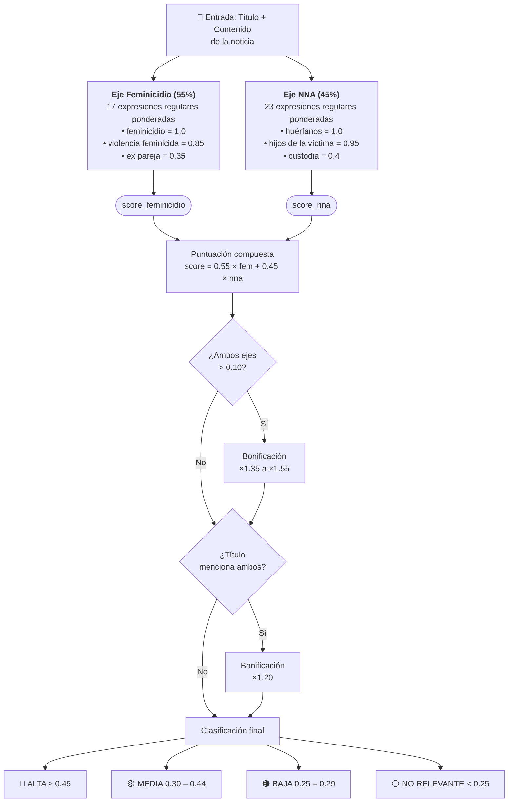
```mermaid
flowchart TD
    ENTRADA["📄 Entrada: Título + Contenido<br/>de la noticia"]

    ENTRADA --> FEM["<b>Eje Feminicidio (55%)</b><br/>17 expresiones regulares ponderadas<br/>• feminicidio = 1.0<br/>• violencia feminicida = 0.85<br/>• ex pareja = 0.35"]

    ENTRADA --> NNA["<b>Eje NNA (45%)</b><br/>23 expresiones regulares ponderadas<br/>• huérfanos = 1.0<br/>• hijos de la víctima = 0.95<br/>• custodia = 0.4"]

    FEM --> SFEM(["score_feminicidio"])
    NNA --> SNNA(["score_nna"])

    SFEM --> COMPUESTO["Puntuación compuesta<br/>score = 0.55 × fem + 0.45 × nna"]
    SNNA --> COMPUESTO

    COMPUESTO --> AMBOS{¿Ambos ejes<br/>> 0.10?}

    AMBOS -- Sí --> BOOST1["Bonificación<br/>×1.35 a ×1.55"]
    AMBOS -- No --> TITULO_CHECK

    BOOST1 --> TITULO_CHECK{¿Título<br/>menciona ambos?}

    TITULO_CHECK -- Sí --> BOOST2["Bonificación<br/>×1.20"]
    TITULO_CHECK -- No --> CLASIF

    BOOST2 --> CLASIF

    CLASIF["Clasificación final"]
    CLASIF --> ALTA["🔴 ALTA ≥ 0.45"]
    CLASIF --> MEDIA["🟡 MEDIA 0.30 – 0.44"]
    CLASIF --> BAJA["🟠 BAJA 0.25 – 0.29"]
    CLASIF --> NO_REL["⚪ NO RELEVANTE < 0.25"]
```

---

## 10. Diagrama de Flujo — Deduplicación en Cascada

**Plataforma:** https://mermaid.live

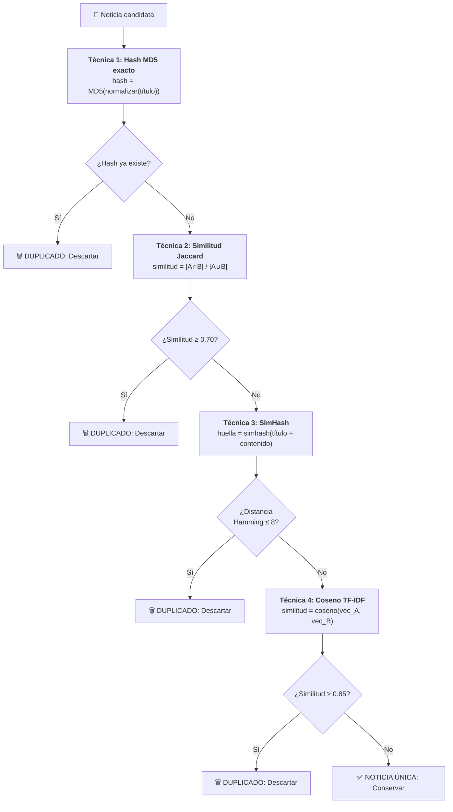
```mermaid
flowchart TD
    ENTRADA["📄 Noticia candidata"] --> T1

    T1["<b>Técnica 1: Hash MD5 exacto</b><br/>hash = MD5(normalizar(título))"]
    T1 --> C1{¿Hash ya existe?}
    C1 -- Sí --> DUP1["🗑️ DUPLICADO: Descartar"]
    C1 -- No --> T2

    T2["<b>Técnica 2: Similitud Jaccard</b><br/>similitud = |A∩B| / |A∪B|"]
    T2 --> C2{¿Similitud ≥ 0.70?}
    C2 -- Sí --> DUP2["🗑️ DUPLICADO: Descartar"]
    C2 -- No --> T3

    T3["<b>Técnica 3: SimHash</b><br/>huella = simhash(título + contenido)"]
    T3 --> C3{¿Distancia<br/>Hamming ≤ 8?}
    C3 -- Sí --> DUP3["🗑️ DUPLICADO: Descartar"]
    C3 -- No --> T4

    T4["<b>Técnica 4: Coseno TF-IDF</b><br/>similitud = coseno(vec_A, vec_B)"]
    T4 --> C4{¿Similitud ≥ 0.85?}
    C4 -- Sí --> DUP4["🗑️ DUPLICADO: Descartar"]
    C4 -- No --> UNICA["✅ NOTICIA ÚNICA: Conservar"]
```

---

## 11. Diagrama de Secuencia — Iniciar Sesión (CU-01)

**Plataforma:** https://www.plantuml.com/plantuml/uml

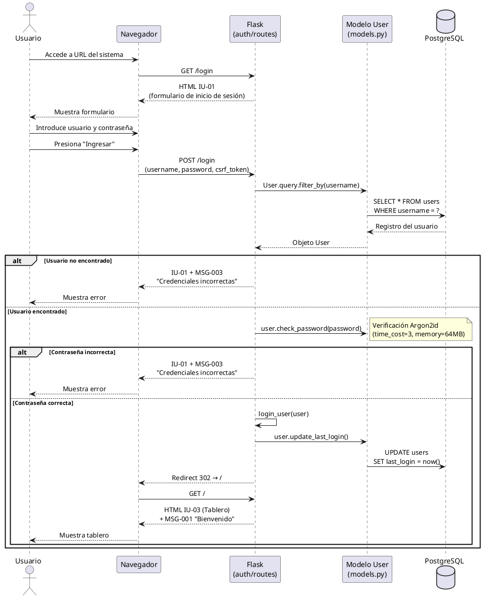
```plantuml
@startuml SecuenciaLogin
skinparam sequenceMessageAlign center
skinparam responseMessageBelowArrow true

actor "Usuario" as U
participant "Navegador" as N
participant "Flask\n(auth/routes)" as F
participant "Modelo User\n(models.py)" as M
database "PostgreSQL" as DB

U -> N: Accede a URL del sistema
N -> F: GET /login
F --> N: HTML IU-01\n(formulario de inicio de sesión)
N --> U: Muestra formulario

U -> N: Introduce usuario y contraseña
U -> N: Presiona "Ingresar"
N -> F: POST /login\n(username, password, csrf_token)

F -> M: User.query.filter_by(username)
M -> DB: SELECT * FROM users\nWHERE username = ?
DB --> M: Registro del usuario
M --> F: Objeto User

alt Usuario no encontrado
    F --> N: IU-01 + MSG-003\n"Credenciales incorrectas"
    N --> U: Muestra error
else Usuario encontrado
    F -> M: user.check_password(password)
    note right: Verificación Argon2id\n(time_cost=3, memory=64MB)

    alt Contraseña incorrecta
        F --> N: IU-01 + MSG-003\n"Credenciales incorrectas"
        N --> U: Muestra error
    else Contraseña correcta
        F -> F: login_user(user)
        F -> M: user.update_last_login()
        M -> DB: UPDATE users\nSET last_login = now()
        F --> N: Redirect 302 → /
        N -> F: GET /
        F --> N: HTML IU-03 (Tablero)\n+ MSG-001 "Bienvenido"
        N --> U: Muestra tablero
    end
end

@enduml
```

---

## 12. Diagrama de Secuencia — Consultar Tablero (CU-03)

**Plataforma:** https://www.plantuml.com/plantuml/uml

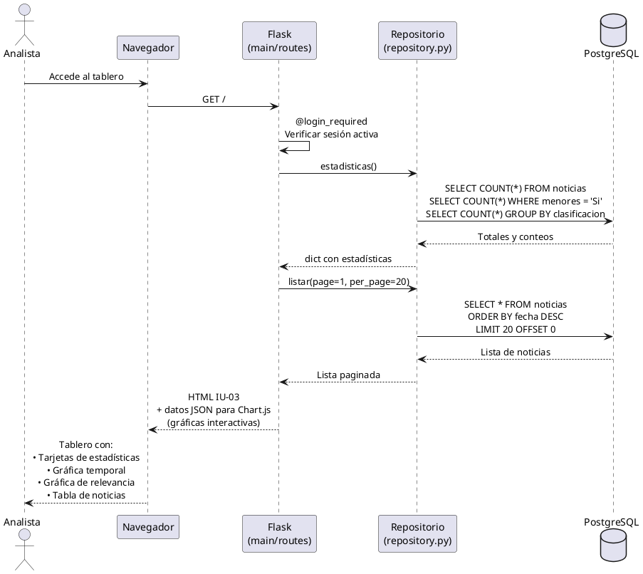
```plantuml
@startuml SecuenciaTablero
skinparam sequenceMessageAlign center

actor "Analista" as U
participant "Navegador" as N
participant "Flask\n(main/routes)" as F
participant "Repositorio\n(repository.py)" as R
database "PostgreSQL" as DB

U -> N: Accede al tablero
N -> F: GET /
F -> F: @login_required\nVerificar sesión activa

F -> R: estadisticas()
R -> DB: SELECT COUNT(*) FROM noticias\nSELECT COUNT(*) WHERE menores = 'Si'\nSELECT COUNT(*) GROUP BY clasificacion
DB --> R: Totales y conteos
R --> F: dict con estadísticas

F -> R: listar(page=1, per_page=20)
R -> DB: SELECT * FROM noticias\nORDER BY fecha DESC\nLIMIT 20 OFFSET 0
DB --> R: Lista de noticias
R --> F: Lista paginada

F --> N: HTML IU-03\n+ datos JSON para Chart.js\n(gráficas interactivas)
N --> U: Tablero con:\n• Tarjetas de estadísticas\n• Gráfica temporal\n• Gráfica de relevancia\n• Tabla de noticias

@enduml
```

---

## 13. Diagrama de Secuencia — Buscar Noticias (CU-04)

**Plataforma:** https://www.plantuml.com/plantuml/uml

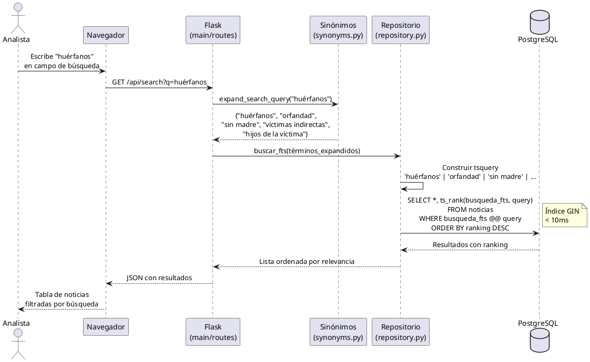
```plantuml
@startuml SecuenciaBusqueda
skinparam sequenceMessageAlign center

actor "Analista" as U
participant "Navegador" as N
participant "Flask\n(main/routes)" as F
participant "Sinónimos\n(synonyms.py)" as S
participant "Repositorio\n(repository.py)" as R
database "PostgreSQL" as DB

U -> N: Escribe "huérfanos"\nen campo de búsqueda
N -> F: GET /api/search?q=huérfanos

F -> S: expand_search_query("huérfanos")
S --> F: {"huérfanos", "orfandad",\n"sin madre", "víctimas indirectas",\n"hijos de la víctima"}

F -> R: buscar_fts(términos_expandidos)
R -> R: Construir tsquery\n'huérfanos' | 'orfandad' | 'sin madre' | ...
R -> DB: SELECT *, ts_rank(busqueda_fts, query)\nFROM noticias\nWHERE busqueda_fts @@ query\nORDER BY ranking DESC
note right: Índice GIN\n< 10ms
DB --> R: Resultados con ranking
R --> F: Lista ordenada por relevancia

F --> N: JSON con resultados
N --> U: Tabla de noticias\nfiltradas por búsqueda

@enduml
```

---

## 14. Diagrama de Secuencia — Gestionar Fuentes (CU-05)

**Plataforma:** https://www.plantuml.com/plantuml/uml

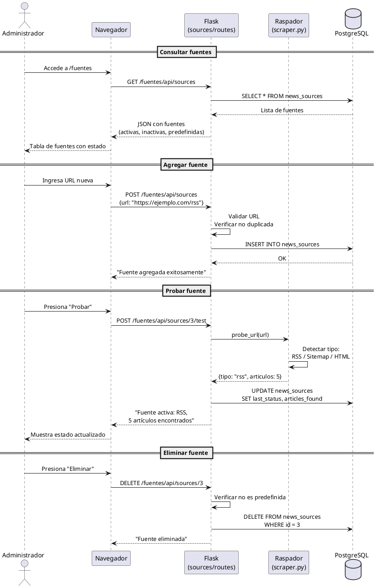
```plantuml
@startuml SecuenciaFuentes
skinparam sequenceMessageAlign center

actor "Administrador" as U
participant "Navegador" as N
participant "Flask\n(sources/routes)" as F
participant "Raspador\n(scraper.py)" as S
database "PostgreSQL" as DB

== Consultar fuentes ==
U -> N: Accede a /fuentes
N -> F: GET /fuentes/api/sources
F -> DB: SELECT * FROM news_sources
DB --> F: Lista de fuentes
F --> N: JSON con fuentes\n(activas, inactivas, predefinidas)
N --> U: Tabla de fuentes con estado

== Agregar fuente ==
U -> N: Ingresa URL nueva
N -> F: POST /fuentes/api/sources\n{url: "https://ejemplo.com/rss"}
F -> F: Validar URL\nVerificar no duplicada
F -> DB: INSERT INTO news_sources
DB --> F: OK
F --> N: "Fuente agregada exitosamente"

== Probar fuente ==
U -> N: Presiona "Probar"
N -> F: POST /fuentes/api/sources/3/test
F -> S: probe_url(url)
S -> S: Detectar tipo:\nRSS / Sitemap / HTML
S --> F: {tipo: "rss", articulos: 5}
F -> DB: UPDATE news_sources\nSET last_status, articles_found
F --> N: "Fuente activa: RSS,\n5 artículos encontrados"
N --> U: Muestra estado actualizado

== Eliminar fuente ==
U -> N: Presiona "Eliminar"
N -> F: DELETE /fuentes/api/sources/3
F -> F: Verificar no es predefinida
F -> DB: DELETE FROM news_sources\nWHERE id = 3
F --> N: "Fuente eliminada"

@enduml
```

---

## 15. Diagrama de Secuencia — Análisis Automático

**Plataforma:** https://www.plantuml.com/plantuml/uml

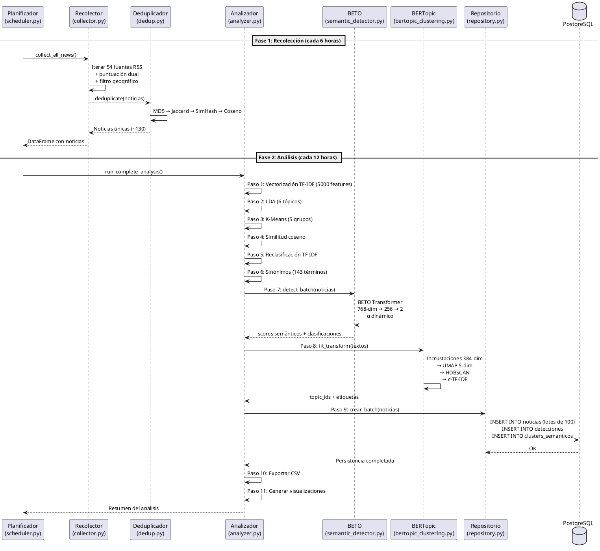
```plantuml
@startuml SecuenciaAnalisis
skinparam sequenceMessageAlign center

participant "Planificador\n(scheduler.py)" as PLAN
participant "Recolector\n(collector.py)" as COL
participant "Deduplicador\n(dedup.py)" as DEDUP
participant "Analizador\n(analyzer.py)" as ANA
participant "BETO\n(semantic_detector.py)" as BETO
participant "BERTopic\n(bertopic_clustering.py)" as BTOP
participant "Repositorio\n(repository.py)" as REPO
database "PostgreSQL" as DB

== Fase 1: Recolección (cada 6 horas) ==

PLAN -> COL: collect_all_news()
COL -> COL: Iterar 54 fuentes RSS\n+ puntuación dual\n+ filtro geográfico
COL -> DEDUP: deduplicate(noticias)
DEDUP -> DEDUP: MD5 → Jaccard → SimHash → Coseno
DEDUP --> COL: Noticias únicas (~130)
COL --> PLAN: DataFrame con noticias

== Fase 2: Análisis (cada 12 horas) ==

PLAN -> ANA: run_complete_analysis()

ANA -> ANA: Paso 1: Vectorización TF-IDF (5000 features)
ANA -> ANA: Paso 2: LDA (6 tópicos)
ANA -> ANA: Paso 3: K-Means (5 grupos)
ANA -> ANA: Paso 4: Similitud coseno
ANA -> ANA: Paso 5: Reclasificación TF-IDF
ANA -> ANA: Paso 6: Sinónimos (143 términos)

ANA -> BETO: Paso 7: detect_batch(noticias)
BETO -> BETO: BETO Transformer\n768-dim → 256 → 2\nα dinámico
BETO --> ANA: scores semánticos + clasificaciones

ANA -> BTOP: Paso 8: fit_transform(textos)
BTOP -> BTOP: Incrustaciones 384-dim\n→ UMAP 5-dim\n→ HDBSCAN\n→ c-TF-IDF
BTOP --> ANA: topic_ids + etiquetas

ANA -> REPO: Paso 9: crear_batch(noticias)
REPO -> DB: INSERT INTO noticias (lotes de 100)\nINSERT INTO detecciones\nINSERT INTO clusters_semanticos
DB --> REPO: OK
REPO --> ANA: Persistencia completada

ANA -> ANA: Paso 10: Exportar CSV
ANA -> ANA: Paso 11: Generar visualizaciones

ANA --> PLAN: Resumen del análisis

@enduml
```

---

## 16. Diagrama de Estados — Ciclo de vida de una Noticia

**Plataforma:** https://www.plantuml.com/plantuml/uml

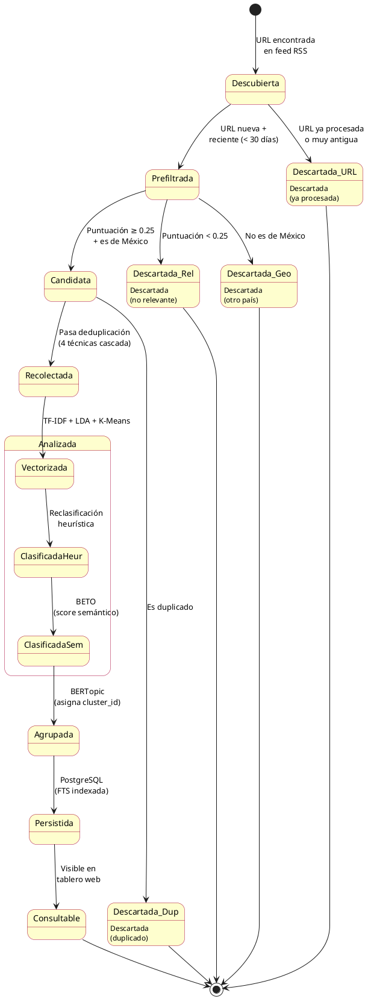
```plantuml
@startuml EstadosNoticia
skinparam state {
  BackgroundColor #FEFECE
  BorderColor #A80036
}

[*] --> Descubierta : URL encontrada\nen feed RSS

Descubierta --> Prefiltrada : URL nueva +\nreciente (< 30 días)
Descubierta --> Descartada_URL : URL ya procesada\no muy antigua

Prefiltrada --> Candidata : Puntuación ≥ 0.25\n+ es de México
Prefiltrada --> Descartada_Rel : Puntuación < 0.25
Prefiltrada --> Descartada_Geo : No es de México

Candidata --> Recolectada : Pasa deduplicación\n(4 técnicas cascada)
Candidata --> Descartada_Dup : Es duplicado

state "Analizada" as Analizada {
  Recolectada --> Vectorizada : TF-IDF + LDA + K-Means
  Vectorizada --> ClasificadaHeur : Reclasificación\nheurística
  ClasificadaHeur --> ClasificadaSem : BETO\n(score semántico)
}

ClasificadaSem --> Agrupada : BERTopic\n(asigna cluster_id)

Agrupada --> Persistida : PostgreSQL\n(FTS indexada)

Persistida --> Consultable : Visible en\ntablero web

state Descartada_URL : Descartada\n(ya procesada)
state Descartada_Rel : Descartada\n(no relevante)
state Descartada_Geo : Descartada\n(otro país)
state Descartada_Dup : Descartada\n(duplicado)

Descartada_URL --> [*]
Descartada_Rel --> [*]
Descartada_Geo --> [*]
Descartada_Dup --> [*]
Consultable --> [*]

@enduml
```

---

## 17. Diagrama de Estados — Sesión de Usuario

**Plataforma:** https://www.plantuml.com/plantuml/uml

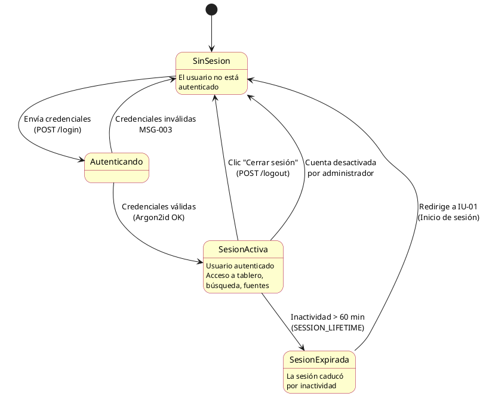
```plantuml
@startuml EstadosSesion
skinparam state {
  BackgroundColor #FEFECE
  BorderColor #A80036
}

[*] --> SinSesion

SinSesion : El usuario no está\nautenticado

SinSesion --> Autenticando : Envía credenciales\n(POST /login)

Autenticando --> SesionActiva : Credenciales válidas\n(Argon2id OK)
Autenticando --> SinSesion : Credenciales inválidas\nMSG-003

SesionActiva : Usuario autenticado\nAcceso a tablero,\nbúsqueda, fuentes

SesionActiva --> SesionExpirada : Inactividad > 60 min\n(SESSION_LIFETIME)
SesionActiva --> SinSesion : Clic "Cerrar sesión"\n(POST /logout)
SesionActiva --> SinSesion : Cuenta desactivada\npor administrador

SesionExpirada : La sesión caducó\npor inactividad

SesionExpirada --> SinSesion : Redirige a IU-01\n(Inicio de sesión)

@enduml
```

---

## 18. Diagrama de Navegación

**Plataforma:** https://mermaid.live

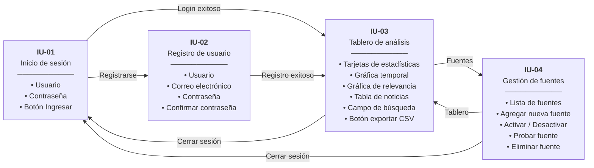
```mermaid
flowchart LR
    IU01["<b>IU-01</b><br/>Inicio de sesión<br/>───────────<br/>• Usuario<br/>• Contraseña<br/>• Botón Ingresar"]

    IU02["<b>IU-02</b><br/>Registro de usuario<br/>───────────<br/>• Usuario<br/>• Correo electrónico<br/>• Contraseña<br/>• Confirmar contraseña"]

    IU03["<b>IU-03</b><br/>Tablero de análisis<br/>───────────<br/>• Tarjetas de estadísticas<br/>• Gráfica temporal<br/>• Gráfica de relevancia<br/>• Tabla de noticias<br/>• Campo de búsqueda<br/>• Botón exportar CSV"]

    IU04["<b>IU-04</b><br/>Gestión de fuentes<br/>───────────<br/>• Lista de fuentes<br/>• Agregar nueva fuente<br/>• Activar / Desactivar<br/>• Probar fuente<br/>• Eliminar fuente"]

    IU01 -- "Login exitoso" --> IU03
    IU01 -- "Registrarse" --> IU02
    IU02 -- "Registro exitoso" --> IU03
    IU03 -- "Fuentes" --> IU04
    IU04 -- "Tablero" --> IU03
    IU03 -- "Cerrar sesión" --> IU01
    IU04 -- "Cerrar sesión" --> IU01
```

---

## 19. Diagrama de Clases

**Plataforma:** https://www.plantuml.com/plantuml/uml

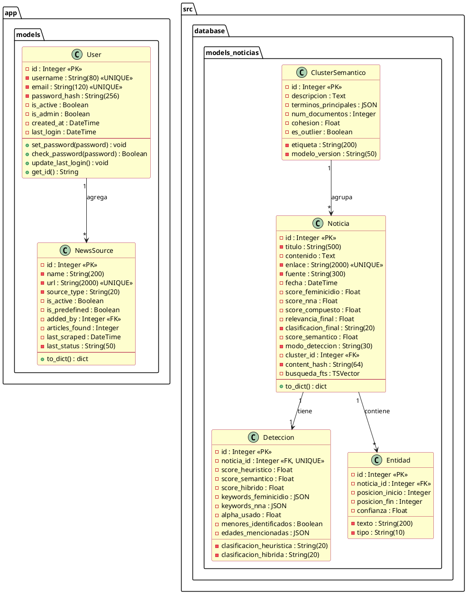
```plantuml
@startuml DiagramaClases
skinparam class {
  BackgroundColor #FEFECE
  BorderColor #A80036
}

package "app.models" {
  class User {
    - id : Integer <<PK>>
    - username : String(80) <<UNIQUE>>
    - email : String(120) <<UNIQUE>>
    - password_hash : String(256)
    - is_active : Boolean
    - is_admin : Boolean
    - created_at : DateTime
    - last_login : DateTime
    --
    + set_password(password) : void
    + check_password(password) : Boolean
    + update_last_login() : void
    + get_id() : String
  }

  class NewsSource {
    - id : Integer <<PK>>
    - name : String(200)
    - url : String(2000) <<UNIQUE>>
    - source_type : String(20)
    - is_active : Boolean
    - is_predefined : Boolean
    - added_by : Integer <<FK>>
    - articles_found : Integer
    - last_scraped : DateTime
    - last_status : String(50)
    --
    + to_dict() : dict
  }
}

package "src.database.models_noticias" {
  class Noticia {
    - id : Integer <<PK>>
    - titulo : String(500)
    - contenido : Text
    - enlace : String(2000) <<UNIQUE>>
    - fuente : String(300)
    - fecha : DateTime
    - score_feminicidio : Float
    - score_nna : Float
    - score_compuesto : Float
    - relevancia_final : Float
    - clasificacion_final : String(20)
    - score_semantico : Float
    - modo_deteccion : String(30)
    - cluster_id : Integer <<FK>>
    - content_hash : String(64)
    - busqueda_fts : TSVector
    --
    + to_dict() : dict
  }

  class Deteccion {
    - id : Integer <<PK>>
    - noticia_id : Integer <<FK, UNIQUE>>
    - score_heuristico : Float
    - score_semantico : Float
    - score_hibrido : Float
    - clasificacion_heuristica : String(20)
    - clasificacion_hibrida : String(20)
    - keywords_feminicidio : JSON
    - keywords_nna : JSON
    - alpha_usado : Float
    - menores_identificados : Boolean
    - edades_mencionadas : JSON
  }

  class ClusterSemantico {
    - id : Integer <<PK>>
    - etiqueta : String(200)
    - descripcion : Text
    - terminos_principales : JSON
    - num_documentos : Integer
    - cohesion : Float
    - es_outlier : Boolean
    - modelo_version : String(50)
  }

  class Entidad {
    - id : Integer <<PK>>
    - noticia_id : Integer <<FK>>
    - texto : String(200)
    - tipo : String(10)
    - posicion_inicio : Integer
    - posicion_fin : Integer
    - confianza : Float
  }
}

User "1" --> "*" NewsSource : agrega
ClusterSemantico "1" --> "*" Noticia : agrupa
Noticia "1" --> "1" Deteccion : tiene
Noticia "1" --> "*" Entidad : contiene

@enduml
```

---

## 20. Diagrama de Paquetes

**Plataforma:** https://www.plantuml.com/plantuml/uml

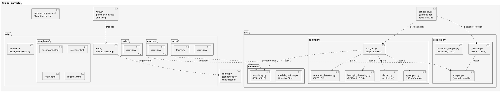
```plantuml
@startuml DiagramaPaquetes
skinparam package {
  BackgroundColor #F5F5F5
  BorderColor #666666
}

package "Raíz del proyecto" {

  package "app/" as APP {
    package "auth/" {
      [routes.py] as AUTH_R
      [forms.py] as AUTH_F
    }
    package "main/" {
      [routes.py] as MAIN_R
    }
    package "sources/" {
      [routes.py] as SRC_R
    }
    package "templates/" {
      [dashboard.html]
      [sources.html]
      [login.html]
      [register.html]
    }
    [__init__.py\n(fábrica de la app)] as APP_INIT
    [models.py\n(User, NewsSource)] as APP_MOD
  }

  package "src/" as SRC {
    package "analysis/" {
      [analyzer.py\n(flujo 11 pasos)] as ANA
      [semantic_detector.py\n(BETO, OE-1)] as SEM
      [bertopic_clustering.py\n(BERTopic, OE-4)] as BTP
      [dedup.py\n(4 técnicas)] as DDP
      [synonyms.py\n(143 sinónimos)] as SYN
    }
    package "collection/" {
      [collector.py\n(RSS + scoring)] as COL
      [scraper.py\n(raspado stealth)] as SCR
      [historical_scraper.py\n(Wayback, OE-2)] as HIST
    }
    package "database/" {
      [models_noticias.py\n(4 tablas ORM)] as DBM
      [repository.py\n(FTS + CRUD)] as REP
    }
  }

  [config.py\n(configuración\ncentralizada)] as CONF
  [scheduler.py\n(planificador\ncada 6h/12h)] as SCHED
  [wsgi.py\n(punto de entrada\nGunicorn)] as WSGI
  [docker-compose.yml\n(3 contenedores)] as DOCKER
}

WSGI ..> APP_INIT : crea app
SCHED ..> ANA : ejecuta análisis
SCHED ..> COL : ejecuta recolección
ANA ..> SEM : paso 7
ANA ..> BTP : paso 8
ANA ..> DDP : paso 4
ANA ..> SYN : paso 6
ANA ..> REP : paso 9
COL ..> SCR : raspar
MAIN_R ..> REP : consultar
SRC_R ..> SCR : probar fuente
APP_INIT ..> CONF : cargar config

@enduml
```

---

## 21. Diagrama de Flujo — Detección Semántica BETO (OE-1)

**Plataforma:** https://mermaid.live

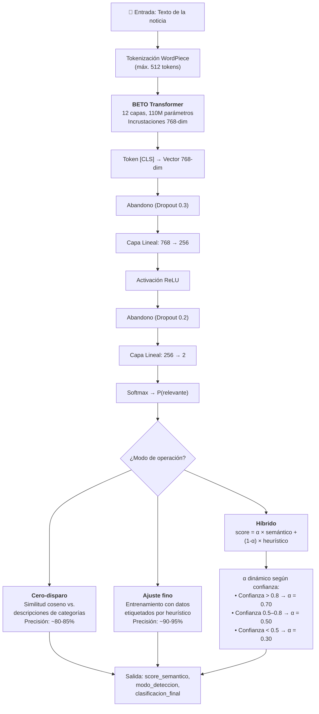
```mermaid
flowchart TD
    ENTRADA["📄 Entrada: Texto de la noticia"]
    ENTRADA --> TOKEN["Tokenización WordPiece<br/>(máx. 512 tokens)"]
    TOKEN --> BETO["<b>BETO Transformer</b><br/>12 capas, 110M parámetros<br/>Incrustaciones 768-dim"]
    BETO --> CLS["Token [CLS] → Vector 768-dim"]
    CLS --> DROP1["Abandono (Dropout 0.3)"]
    DROP1 --> LIN1["Capa Lineal: 768 → 256"]
    LIN1 --> RELU["Activación ReLU"]
    RELU --> DROP2["Abandono (Dropout 0.2)"]
    DROP2 --> LIN2["Capa Lineal: 256 → 2"]
    LIN2 --> SOFT["Softmax → P(relevante)"]

    SOFT --> MODO{¿Modo de operación?}

    MODO --> ZS["<b>Cero-disparo</b><br/>Similitud coseno vs.<br/>descripciones de categorías<br/>Precisión: ~80-85%"]

    MODO --> FT["<b>Ajuste fino</b><br/>Entrenamiento con datos<br/>etiquetados por heurístico<br/>Precisión: ~90-95%"]

    MODO --> HY["<b>Híbrido</b><br/>score = α × semántico +<br/>(1-α) × heurístico"]

    HY --> ALFA["α dinámico según confianza:<br/>• Confianza > 0.8 → α = 0.70<br/>• Confianza 0.5–0.8 → α = 0.50<br/>• Confianza < 0.5 → α = 0.30"]

    ZS --> SALIDA["Salida: score_semantico,<br/>modo_deteccion,<br/>clasificacion_final"]
    FT --> SALIDA
    ALFA --> SALIDA
```

---

## 22. Diagrama de Flujo — Agrupamiento BERTopic (OE-4)

**Plataforma:** https://mermaid.live

```mermaid
flowchart TD
    ENTRADA["📚 Corpus de noticias analizadas"]

    ENTRADA --> EMB["<b>1. Generación de incrustaciones</b><br/>Modelo: paraphrase-multilingual-MiniLM-L12-v2<br/>Salida: vectores 384-dim por noticia"]

    EMB --> UMAP["<b>2. Reducción de dimensionalidad — UMAP</b><br/>384 dims → 5 dims<br/>n_neighbors=15, min_dist=0.0, métrica=coseno"]

    UMAP --> HDBSCAN["<b>3. Agrupamiento — HDBSCAN</b><br/>min_cluster_size=8, min_samples=5<br/>Detección automática del nº de grupos"]

    HDBSCAN --> CHECK{¿Documento asignado<br/>a un grupo?}

    CHECK -- Sí --> ASIGNAR["Asignar topic_id"]

    CHECK -- No --> REASIG["<b>Reasignación multi-etapa</b>"]
    REASIG --> E1["Etapa 1: Probabilidades blandas<br/>P(grupo) ≥ 0.05 → reasignar"]
    E1 --> E2["Etapa 2: Distribución c-TF-IDF<br/>Comparar vs. centroides"]
    E2 --> E3["Etapa 3: Incrustaciones<br/>Distancia coseno vs. centroides"]

    E3 --> PUEDE{¿Se pudo reasignar?}
    PUEDE -- Sí --> ASIGNAR2["Asignar topic_id"]
    PUEDE -- No --> OUTLIER["Mantener como<br/>valor atípico (topic -1)"]

    ASIGNAR --> CTFIDF
    ASIGNAR2 --> CTFIDF
    OUTLIER --> CTFIDF

    CTFIDF["<b>4. Representación de temas — c-TF-IDF</b><br/>Términos más representativos por grupo<br/>Ej: Feminicidio · Menor · Huérfano"]

    CTFIDF --> LABEL["<b>5. Etiquetado automático</b><br/>KeyBERTInspired"]

    LABEL --> SALIDA["Salida: topic_id, etiqueta,<br/>términos_principales, cohesión"]

    SALIDA --> PERSIST["Persistir en tabla<br/>clusters_semanticos (PostgreSQL)"]
```

---

## 23. Diagrama de Flujo — Búsqueda FTS (OE-3)

**Plataforma:** https://mermaid.live

```mermaid
flowchart TD
    ENTRADA["🔍 Consulta del usuario<br/>Ej: huérfanos"]

    ENTRADA --> EXPAND["<b>Expandir con sinónimos</b><br/>synonyms.py → 143 términos<br/><br/>huérfanos → {huérfanos, orfandad,<br/>sin madre, víctimas indirectas,<br/>hijos de la víctima}"]

    EXPAND --> TSQUERY["<b>Construir tsquery</b><br/>'huérfanos' | 'orfandad' |<br/>'sin madre' | ..."]

    TSQUERY --> EXEC["<b>Ejecutar en PostgreSQL</b><br/>SELECT *, ts_rank(busqueda_fts, query)<br/>FROM noticias<br/>WHERE busqueda_fts @@ query<br/>ORDER BY ranking DESC"]

    EXEC --> GIN["Índice GIN<br/>Tiempo: < 10ms"]

    GIN --> RESULT["Resultados ordenados<br/>por relevancia (ts_rank)"]

    RESULT --> RESP["Respuesta JSON al navegador"]
```

---

## 24. Diagrama de Actividades — Ciclo Completo

**Plataforma:** https://www.plantuml.com/plantuml/uml

```plantuml
@startuml ActividadesCiclo
|Planificador|
start
:Iniciar sistema Docker;

fork
  |Planificador|
  :Esperar 6 horas;
  |Recolección|
  :Cargar 54 fuentes RSS;
  :Iterar cada fuente;
  while (¿Quedan fuentes?) is (Sí)
    :Descargar feed;
    if (¿URL nueva y reciente?) then (Sí)
      :Calcular puntuación dual\n(feminicidio 55% × NNA 45%);
      if (¿Puntuación ≥ 0.25?) then (Sí)
        :Aplicar filtro geográfico;
        if (¿Es de México?) then (Sí)
          :Agregar al lote;
        else (No)
          :Descartar;
        endif
      else (No)
        :Descartar;
      endif
    else (No)
      :Omitir;
    endif
  endwhile (No)
  :Deduplicar lote\n(MD5 → Jaccard → SimHash → Coseno);
  |Persistencia|
  :Guardar en CSV;
  :Registrar URLs procesadas;

fork again
  |Planificador|
  :Esperar 12 horas;
  |Análisis|
  :Paso 1: Vectorización TF-IDF;
  :Paso 2: LDA (6 tópicos);
  :Paso 3: K-Means (5 grupos);
  :Paso 4: Similitud coseno;
  :Paso 5: Reclasificación TF-IDF;
  :Paso 6: Expansión con sinónimos;
  :Paso 7 (OE-1): Detección\nsemántica BETO;
  :Paso 8 (OE-4): Agrupamiento\nsemántico BERTopic;
  |Persistencia|
  :Paso 9 (OE-3): Insertar en\nPostgreSQL + FTS;
  |Análisis|
  :Paso 10: Exportar CSV;
  :Paso 11: Generar visualizaciones;

fork again
  |Presentación|
  :Servir aplicación web\n(Flask + Gunicorn, puerto 5000);
  :Esperar peticiones HTTP;
  while (¿Petición recibida?) is (Sí)
    if (¿Autenticado?) then (Sí)
      :Procesar petición\n(tablero / búsqueda / fuentes / API);
      |Persistencia|
      :Consultar PostgreSQL;
      |Presentación|
      :Devolver respuesta\n(HTML o JSON);
    else (No)
      :Redirigir a\ninicio de sesión;
    endif
  endwhile (No)
end fork

stop

@enduml
```

---

## Instrucciones rápidas

### Para dbdiagram.io (Diagrama #1):
1. Ve a https://dbdiagram.io
2. Borra el contenido del editor izquierdo
3. Pega el código de la sección 1
4. El diagrama aparece automáticamente a la derecha
5. Exporta como PNG o PDF desde el menú

### Para PlantUML (Diagramas #2, #3, #6, #11–#17, #19, #20, #24):
1. Ve a https://www.plantuml.com/plantuml/uml
2. Borra el contenido del editor
3. Pega el código (incluyendo `@startuml` y `@enduml`)
4. Presiona "Submit" o espera a que se renderice
5. Clic derecho en la imagen → "Guardar imagen como..."
6. **Alternativa local:** Instala extensión "PlantUML" en VS Code

### Para Mermaid (Diagramas #4, #5, #7–#10, #18, #21–#23):
1. Ve a https://mermaid.live
2. Borra el contenido del editor izquierdo
3. Pega el código (sin las marcas ` ```mermaid ` y ` ``` `)
4. El diagrama se renderiza al instante
5. Exporta como PNG o SVG desde los botones superiores
