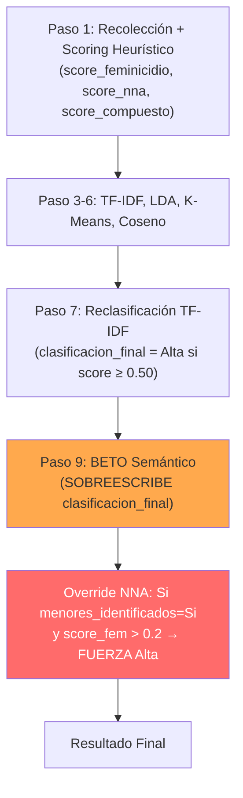
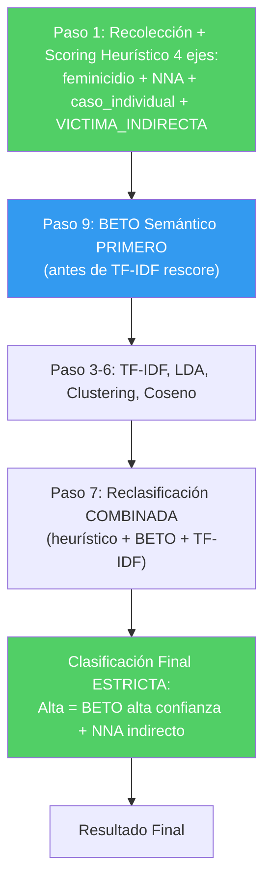

# 🔍 Análisis del Pipeline: Por qué hay falsos positivos en "Alta Relevancia"

## El Problema

De 4 noticias clasificadas como "Alta relevancia", solo 1 es realmente objetivo del sistema:

| Noticia | ¿Relevante? | ¿Por qué? |
|---------|-------------|-----------|
| ¡Frente a su hijo de 5 años! Mariana es asesinada... | ✅ **SÍ** | Feminicidio + niño presenció + quedó huérfano |
| Atiende Semujeres a 328 menores por violencia feminicida... | ❌ **NO** | Estadísticas/programa de apoyo, no caso concreto |
| Feminicidio 13: Hijo apuñaló a Heriberta... | ❌ **NO** | El menor es el AGRESOR, no víctima indirecta |
| Vinculan a mujer en Puebla por desaparición y feminicidio de su hija de 8 años | ❌ **NO** | La menor es la VÍCTIMA DIRECTA del feminicidio |
| La familia de Azcapotzalco fue asesinada por el exnovio... | ⚠️ **PARCIAL** | Hay menores víctimas directas (asesinadas también), no indirectas |

## 🔬 Diagnóstico: 5 Causas Raíz

### Causa 1: El "Override NNA" en el Paso 9 fuerza Alta relevancia indiscriminadamente

```python
# analyzer.py, líneas 664-670 (step_9_semantic_detection)
is_nna = str(row.get("menores_identificados", "No")).strip().lower() in ("si", "sí", "true", "1")
h_score_fem = float(row.get("score_feminicidio", 0))

# Si el score de feminicidio inicial era decente (>0.2) y hay NNA, forzar a Alta
if is_nna and h_score_fem > 0.2:
    score_final = max(score_final, 0.65)  # ← FUERZA Alta relevancia
```

> [!CAUTION]
> Esta regla dice: "si la noticia menciona feminicidio Y menciona menores → Alta". Pero NO distingue si el menor es **víctima indirecta** (huérfano), **víctima directa** (asesinada), **agresor**, o mera **estadística**.

### Causa 2: `menores_identificados` tiene umbral demasiado bajo

```python
# collector.py, línea 624
'menores_identificados': 'Si' if score_nna > 0.10 else 'No',
```

Un `score_nna > 0.10` se activa con **cualquier mención** a menores — la palabra "hijos" (0.65), "menores" (0.55), o incluso "niños" (0.50) en el contenido. Esto clasifica como "NNA detectado" a noticias que simplemente **mencionan** niños en cualquier contexto.

### Causa 3: BETO zero-shot no distingue víctima indirecta vs. mención general

Las descripciones de categoría en `CATEGORY_DESCRIPTIONS` dicen:

```python
"relevante": (
    "Caso individual de feminicidio en México donde una mujer fue asesinada "
    "y sus hijos menores de edad quedaron huérfanos, desamparados o en orfandad..."
)
```

Aunque la descripción es buena, el embedding de BETO para un párrafo tan largo se diluye — la semántica de "huérfanos" vs "estadísticas de menores" se pierde en un vector de 768 dimensiones promediado.

### Causa 4: El Paso 7 se sobreescribe completamente en el Paso 9

El Paso 7 (TF-IDF rescore) calcula `clasificacion_final` con umbrales `≥0.50 → Alta`. Pero el Paso 9 **sobreescribe** esta clasificación para TODAS las noticias. Esto significa que el trabajo del Paso 7 no aporta nada al resultado final.

### Causa 5: No existe un eje específico de "víctima indirecta NNA"

El scoring tiene 3 ejes:
1. **Feminicidio** — ¿habla de feminicidio? ✅
2. **NNA** — ¿menciona menores? ✅ (pero demasiado amplio)
3. **Caso individual** — ¿es un caso concreto? ✅

**Falta un 4to eje: "Menor como víctima INDIRECTA"** — ¿el menor quedó huérfano/desamparado por el feminicidio? Esto es el núcleo del sistema y no tiene su propio scoring.

## 📊 Flujo Actual vs. Flujo Propuesto

### Pipeline Actual (problemático)



> [!WARNING]
> El Override NNA en el Paso 9 anula TODO el trabajo semántico de BETO y la reclasificación TF-IDF.

### Pipeline Propuesto (corregido)



## 🛠️ Cambios Propuestos

### Cambio 1: Agregar eje de "Víctima Indirecta NNA" al scoring heurístico

Nuevo eje que detecta específicamente patrones de NNA que QUEDARON huérfanos/desamparados:

```python
VICTIMA_INDIRECTA_NNA_KEYWORDS = [
    # Orfandad / quedaron solos
    (r'\b(?:dej[oó]|dejaron|quedan|quedaron)\s+(?:\w+\s+){0,3}(?:hu[eé]rfan|sin\s+madre|sol[oa]s?|desamparad)', 1.0),
    (r'\bhu[eé]rfan[oa]s?\b', 1.0),
    (r'\borfandad\b', 1.0),
    (r'\bv[ií]ctimas?\s+indirectas?\b', 1.0),
    # El menor presenció / estaba presente
    (r'\bfrente\s+a\s+sus?\s+(?:hijos?|hijas?|menores?)\b', 1.0),
    (r'\bpresenci[oó]\b.*\b(?:asesinat|feminicidio|muerte|crimen)\b', 1.0),
    (r'\b(?:hijos?|hijas?|menores?)\s+(?:presenciaron|vieron|estaban\s+presentes)\b', 1.0),
    # DIF / custodia por orfandad
    (r'\bDIF\s+(?:resguard|entreg|recib|custodi)\b', 0.95),
    (r'\b(?:entregad|resguardad|puestos?\s+bajo)\s+(?:\w+\s+){0,2}DIF\b', 0.95),
    (r'\bcustodia\s+(?:de|del)\s+(?:DIF|estado|abuelos?|familiares)\b', 0.9),
    # N hijos quedan en orfandad
    (r'\b(?:dos|tres|cuatro|cinco|\d)\s+(?:hijos?|hijas?|menores?|ni[ñn][oa]s?)\s+(?:quedan|quedaron|en\s+orfandad)\b', 1.0),
    (r'\b(?:hijos?|hijas?)\s+(?:de\s+)?(?:la\s+)?v[ií]ctima\b', 0.85),
]
```

### Cambio 2: Quitar el Override NNA del Paso 9

Eliminar completamente las líneas 664-670 del `analyzer.py`. BETO debe poder **bajar** el score, no ser anulado.

### Cambio 3: Separar `menores_identificados` de `nna_victima_indirecta`

- `menores_identificados`: se mantiene como ahora (cualquier mención a NNA)
- `nna_victima_indirecta`: **nuevo campo** que se activa SOLO si `score_victima_indirecta > 0.25`

### Cambio 4: Clasificación Final más estricta

```python
# Para ser "Alta" se requiere:
#   1. score_feminicidio > 0.15  (hay feminicidio)
#   2. score_victima_indirecta > 0.20  (hay NNA como víctima indirecta)
#   3. score_caso > 0.10  (es un caso individual, no estadísticas)
#   4. BETO score > 0.50  (BETO confirma relevancia)
# Si alguno falta → máximo "Media"
```

### Cambio 5: Penalización explícita para NNA como agresor o víctima directa

Estos casos actualmente pasan el filtro NNA, pero NO son el objetivo:
- "Hijo apuñaló a su madre" → menor es AGRESOR
- "Feminicidio de niña de 8 años" → menor es VÍCTIMA DIRECTA (no indirecta)
- "328 menores atendidos" → ESTADÍSTICAS

```python
# Menor como víctima directa del feminicidio (ella fue la asesinada)
MENOR_VICTIMA_DIRECTA_PATTERNS = [
    r'\bfeminicidio\s+(?:de|a)\s+(?:una?\s+)?(?:ni[ñn]a|menor|adolescente)\b',
    r'\b(?:ni[ñn]a|menor|adolescente)\s+(?:fue\s+)?(?:asesinada|encontrada\s+sin\s+vida)\b',
    r'\basesinan\s+a\s+(?:una?\s+)?(?:ni[ñn]a|menor)\b',
    r'\bfeminicidio\s+(?:de\s+)?su\s+hija\b',
]
```

## ✅ Resumen de Acciones

| # | Acción | Archivo | Impacto |
|---|--------|---------|---------|
| 1 | Agregar eje `VICTIMA_INDIRECTA_NNA_KEYWORDS` | `collector.py` | Distingue huérfanos de menciones genéricas |
| 2 | Eliminar override NNA en Paso 9 | `analyzer.py` L664-670 | BETO puede corregir falsos positivos |
| 3 | Nuevo campo `nna_victima_indirecta` | `collector.py` + `models_noticias.py` | Separar detección de mención |
| 4 | Clasificación estricta: Alta requiere 4 condiciones | `analyzer.py` | Reduce falsos positivos drásticamente |
| 5 | Penalización NNA víctima directa/agresor | `collector.py` | Evita confundir "feminicidio de niña" con "niña huérfana" |
| 6 | Mejorar descripciones BETO zero-shot | `semantic_detector.py` | Mejor distinción semántica |

> [!IMPORTANT]
> ¿Quieres que implemente estos cambios? Puedo aplicarlos todos de una vez o ir paso a paso para que revises cada uno.
